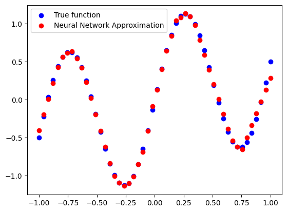

# 基于ReLU的神经网络拟合目标函数的实验

本实验旨在验证一个两层ReLU神经网络是否能够有效地拟合一个目标函数。我们采用全连接神经网络，并通过 **均方误差(MSE)** 来评估模型的拟合效果。

## 函数定义

在本实验中，我们选择以下目标函数进行拟合：

```math
f(x) = \sin(2\pi x) + 0.5x
```

该函数结合了正弦函数和线性项，其中：

* 正弦函数引入周期性变化，增加拟合难度。
* 线性项保证函数的整体趋势。

## 数据采集

我们在 [-1, 1] 范围内均匀采样数据点：

* 训练集：500个数据点
* 测试集：50个数据点

## 模型描述

### 结构

我们使用两层神经网络：

* 输入层：1 维
* 隐藏层：250 个神经元，使用 ReLU 作为激活函数
* 输出层：1 维，线性输出

### 参数初始化

* 权重初始化采用 **He 初始化**（适用于 ReLU），标准差为 $\sqrt{\frac{2}{\text{输入维度}}}$

$$
W \sim \mathcal{N}(0, \sqrt\frac{2}{\text{输入维度}})
$$

* 偏置初始化为零。

## 训练过程

### 计算前向传播

* 隐藏层计算：

$$
z_1 = X W_1 + b_1
$$
$$
a_1 = \text{ReLU}(z_1) = \max(0, z_1)
$$

* 输出层计算（线性变换）：

$$
z_2 = a_1 W_2 + b_2
$$

### 计算损失

损失函数采用**均方误差（MSE）**：

```math
\text{Loss} = \frac{1}{n} \sum (y_{\text{pred}} - y_{\text{true}})^2
```

### 反向传播

* 输出层梯度：

$$
\frac{\partial L}{\partial y_{\text{pred}}} = \frac{2}{n} (y_{\text{pred}} - y_{\text{true}})
$$

* 隐藏层梯度（ReLU导数）：

$$
\frac{\partial L}{\partial z_1} = \frac{\partial L}{\partial a_1} \cdot \mathbb{1}(z_1 > 0)
$$

### 梯度下降

权重更新：

```math
W \leftarrow W - \eta \cdot \frac{\partial L}{\partial W}
```

其中，𝜂 为学习率。

## 结果分析

### 训练结果

* 初始损失较高，训练后迅速降低。
* 损失在后期趋于稳定，表明模型已较好地拟合目标函数。

### 拟合可视化

  
拟合良好，红色（预测值）接近蓝色（真实值）。

## 结论

* 成功拟合了目标函数，MSE 下降至 0.00165。
* ReLU 网络能够有效逼近非线性函数，仅需两层即可完成任务。
